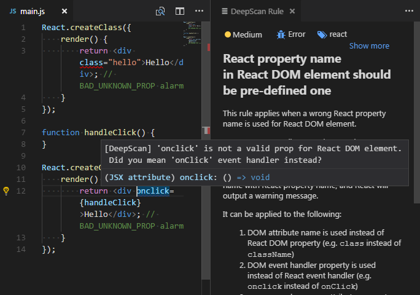

# VS Code DeepScan extension

[](https://marketplace.visualstudio.com/items/DeepScan.vscode-deepscan)
[](https://deepscan.io/dashboard/#view=project&pid=1808&bid=7873)

[VS Code extension](https://marketplace.visualstudio.com/items/DeepScan.vscode-deepscan) to detect bugs and quality issues in JavaScript, TypeScript, React and Vue.js. Works with [DeepScan](https://deepscan.io).

DeepScan is a cutting-edge JavaScript code inspection tool that helps you to find bugs and quality issues more precisely by data-flow analysis. You can also use it for React and Vue.js because DeepScan delivers [React specialized rules](https://deepscan.io/docs/rules/#react) and [Vue.js specialized rules](https://deepscan.io/docs/rules/#vue).

**Note 1:** File Transfer
>
> To use this extension, you should confirm that your code is transferred to the DeepScan server for inspection when you save your changes.
> You can confirm it by pressing the Confirm button that appears when restarting VS Code after the installation.
>
> Note that your code is completely deleted from the server right after the inspection.

**Note 2:** Limitation of Analysis
>
> The analysis is only per the transferred file. Some rules requiring inter-module information, such as [REACT_MISMATCHED_TYPE_OF_PROP](https://deepscan.io/docs/rules/react-mismatched-type-of-prop), does not apply in this plugin. To fully make use of DeepScan, please check out [Embedded Mode](#embedded-mode).



## How it works

- Report issues in Problems panel when you open a `*.js`, `*.jsx`, `*.mjs`, `*.ts`, `*.tsx`, and `*.vue` file and save it.
- Highlight issues in the code.
- Show a rule description using a code action. When you click the light bulb of the issue, you can see the detailed description of the rule and grasp what's the problem.

## Settings Options

This extension contributes the following variables to the settings:

- `deepscan.enable`: enable/disable DeepScan. Disabled by default. Enabled on per workspace when you confirm.
- `deepscan.server`: set an url of DeepScan server. "https://deepscan.io" by default.
- `deepscan.proxy`: set an url of proxy server. When you are [behind a proxy](#using-behind-a-proxy).
- `deepscan.ignoreRules`: set an array of rules to exclude.
  An example to exclude 'UNUSED_DECL' rule:
```json
{
    "deepscan.ignoreRules": [
        "UNUSED_DECL"
    ]
}
```
- `deepscan.ignorePatterns`: set an array of file patterns to exclude.
  An example to exclude a file and `lib` directory:
```json
{
    "deepscan.ignorePatterns": [
        "App.vue", "lib/"
    ]
}
```
- `deepscan.fileSuffixes`: set an array of additional suffixes for files to analyze. (Needs restart to take affect)
  An example to analyze `*.es` file as a JavaScript file:
```json
{
    "deepscan.fileSuffixes": [
        ".es"
    ]
}
```
- `deepscan.showDecorators`: enable/disable to show high and medium problems with inline decorators. Enabled by default.


### Disabling Rules with Inline Comments

While you can exclude rules project wide via `deepscan.ignoreRules` option, you can also disable a rule in a file using inline comment.
```javascript
const x = 0;
x = 1; x + 1; // deepscan-disable-line UNUSED_EXPR
```

By **Ignore this line** and **Ignore this rule** code actions, you can add an inline comment easier.


Read more about it [here](https://deepscan.io/docs/get-started/disabling-rules/).

## Embedded Mode

**Note:** This is a premium feature.
>
> DeepScan supports an embedded mode, which works standalone without DeepScan server. It works with the local language server so you can:
> * never worry about transferring the code outside.
> * analyze a whole project rather than a file.
>
> To activate this, contact us at [support@deepscan.io](mailto:support@deepscan.io).

In the embedded mode, this extension contributes the following commands to the Command palette.

- **Inspect Project**: inspect the current project.
- **Clear Project Problems**: clear inspected problems.

### ESLint Analysis
Run ESLint. You can see the ESLint alarms with DeepScan's.

[eslint package](https://www.npmjs.com/package/eslint) is required in the local or global. Note that `NODE_PATH` environment variable is necessary to load the `eslint` module installed in global.

It directly uses the package so your custom configurations and plugins are applied as is.

- `deepscan.serverEmbedded.eslint.enable`: enable/disable ESLint analysis.
- `deepscan.serverEmbedded.eslint.merge`: option for how identical issues of DeepScan and ESLint are merged. (defaults to `deepscan`)
  * `deepscan`: show only DeepScan issues.
  * `eslint`: show only ESLint issues.
  * `both`: show all issues as is.

## Using behind a proxy

To do an inspection, this extension requires a connection with the DeepScan server. But this connection cannot be established when you are behind a proxy.

For this case, you can try one of the following:

* Set `http_proxy` environment variable: `http_proxy` [is respected](https://www.npmjs.com/package/axios#request-config), if any.
* Set `deepscan.proxy` option: When you do not have/want a system-wide `http_proxy` environment variable, you can set the proxy server's URL in the `deepscan.proxy` option.
